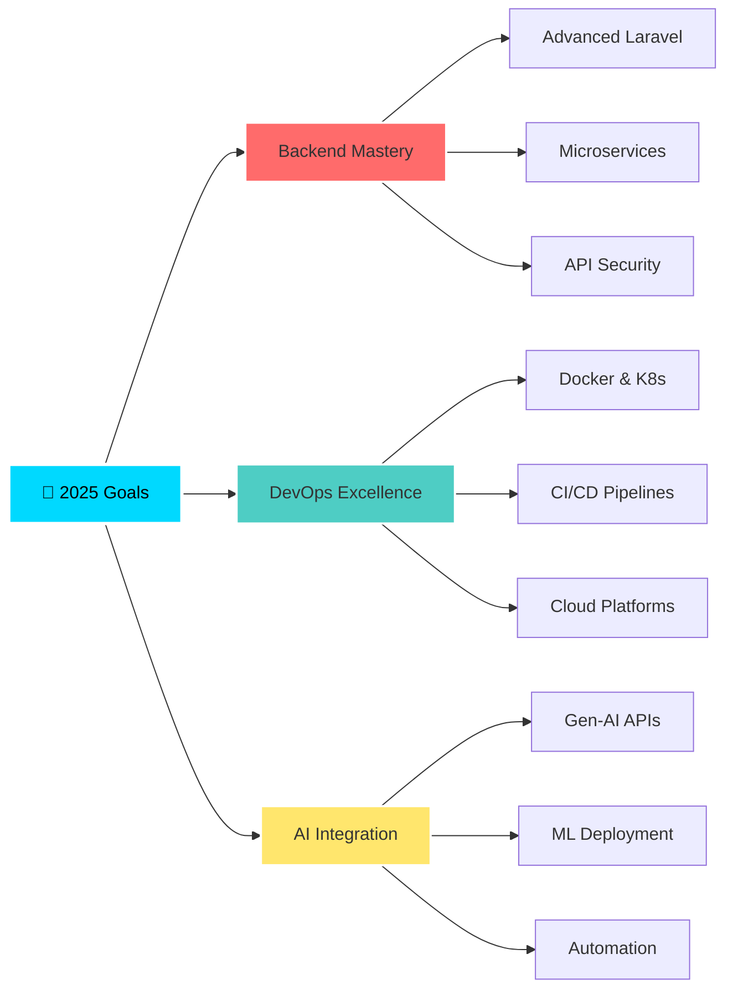

<div align="center">

<!-- Animated Header with Wave Effect -->


<br>

<!-- Dynamic Typing Animation with Multiple Lines -->

  
</a>

<br>

<!-- Animated Badges -->
<p align="center">
  <a href="https://github.com/BilalAhmed-Dev" target="_blank">
    
  </a>
  <a href="https://github.com/BilalAhmed-Dev?tab=followers" target="_blank">
    
  </a>
  <a href="https://github.com/BilalAhmed-Dev?tab=repositories" target="_blank">
    
  </a>
  <a href="https://github.com/BilalAhmed-Dev" target="_blank">
    
  </a>
</p>

<!-- Social Media Animated Icons -->
<p align="center">
  <a href="https://linkedin.com/in/bilal-ahmed-720630246">
    
  </a>
  <a href="mailto:bilalahmed082000@gmail.com">
    
  </a>
  <a href="https://github.com/BilalAhmed-Dev">
    
  </a>
</p>

</div>

<!-- Animated Divider -->


<br>

##  **About Me**


```typescript
const bilalAhmed = {
    fullName: "Bilal Ahmed",
    role: "🎯 Backend Developer",
    location: "📍 Karachi, Pakistan 🇵🇰",
    experience: "💼 1+ Years in Production",
    currentFocus: {
        backend: ["Laravel", "RESTful APIs", "Microservices"],
        devops: ["Docker", "CI/CD", "Kubernetes"],
        aiml: ["Gen-AI Integration", "ML Deployment"],
        database: ["MySQL", "MSSQL", "Query Optimization"]
    },
    languages: ["PHP", "Python", "JavaScript", "SQL"],
    passion: "💡 Building Scalable & Intelligent Systems",
    currentlyLearning: "🚀 DevOps & Cloud Architecture",
    availability: "✅ Open to Remote Opportunities",
    workingHours: "🕐 9 AM - 6 PM PKT",
    codeEditor: "VS Code + Neovim",
    favoriteQuote: "Code is poetry written in logic"
};

console.log(`${bilalAhmed.role} ready to innovate! 🚀`);
```

<br>

### 🎯 **Professional Highlights**

<table>
<tr>
<td width="50%">

#### 💻 Backend Expertise
- ✅ **Laravel Framework** - Advanced proficiency
- ✅ **RESTful API Design** - Scalable architectures
- ✅ **Database Optimization** - Query performance tuning
- ✅ **Authentication & Security** - JWT, OAuth2, Sanctum
- ✅ **Microservices** - Service-oriented architecture

</td>
<td width="50%">

#### 🚀 DevOps Journey
- 🔄 **CI/CD Pipelines** - GitHub Actions, Jenkins
- 🐳 **Containerization** - Docker & Docker Compose
- ☸️ **Orchestration** - Learning Kubernetes
- 📊 **Monitoring** - Server & application metrics
- 🔐 **Security** - Best practices & automation

</td>
</tr>
</table>

<br>

<div align="center">

### 🛠️ **Tech Arsenal**


</div>


<br>

## 🌱 **Currently Learning & Growing**

<div align="center">
<table>
<tr>
<td width="50%" valign="top">

### 🚀 Backend & DevOps


```yaml
🎯 Focus Areas:
  ├─ 🔧 Backend Laravel Development
  │   ├─ Advanced Eloquent ORM
  │   ├─ Queue Management & Jobs
  │   └─ Event-Driven Architecture
  │
  ├─ 🗄️ MySQL Query Optimization
  │   ├─ Index Strategies
  │   ├─ Query Performance Tuning
  │   └─ Database Sharding
  │
  ├─ 🏗️ Building Backend Laravel Products
  │   ├─ SaaS Architecture
  │   ├─ Multi-Tenancy Systems
  │   └─ API Rate Limiting
  │
  ├─ 🔄 RESTful API Architecture
  │   ├─ API Versioning
  │   ├─ Documentation (Swagger/OpenAPI)
  │   └─ Response Standardization
  │
  └─ 🧩 Microservices Design Patterns
      ├─ Service Communication
      ├─ API Gateway Patterns
      └─ Event Sourcing
```

</td>
<td width="50%" valign="top">

### 🤖 AI/ML & Cloud Automation


```yaml
🎯 Exploring:
  ├─ 🧠 Gen-AI Integration
  │   ├─ OpenAI API Integration
  │   ├─ Prompt Engineering
  │   └─ AI-Powered Features
  │
  ├─ 📊 ML Model Deployment
  │   ├─ Model Serving APIs
  │   ├─ Batch Predictions
  │   └─ Real-time Inference
  │
  ├─ ⚙️ Intelligent Workflow Systems
  │   ├─ Automated Decision Making
  │   ├─ Smart Task Routing
  │   └─ Predictive Scheduling
  │
  ├─ 📈 Predictive Analytics
  │   ├─ Data Pipeline Design
  │   ├─ Feature Engineering
  │   └─ Model Monitoring
  │
  └─ 🔌 AI-Powered APIs
      ├─ Natural Language Processing
      ├─ Computer Vision Integration
      └─ Recommendation Systems
```

</td>
</tr>
</table>
</div>

<br>

<div align="center">

### 🎯 **2026 Career Vision**


```diff
+ 🚀 Become a Backend DevOps Engineer Expert
+ 🎯 Master the intersection of backend development, infrastructure automation, and intelligent systems
+ 💡 Build production-grade systems that scale globally
+ 🔧 Contribute to open-source DevOps & Laravel ecosystem
```

</div>


<br>

## 🛠️ **Technology Stack**

<div align="center">

### 💻 **Backend Development**


<br><br>


<br>

### 🤖 **AI/ML & Data Science**


<br><br>


<br>

### 🐳 **DevOps & Cloud Infrastructure**


<br><br>


<br>

### 💾 **Database Management**


<br><br>


<br>

### 🔧 **Development Tools**


<br><br>


<br>

### 🎨 **Frontend (Past Experience)**


<br><br>


</div>


<br>

## 📊 **GitHub Analytics & Performance**

<div align="center">

&nbsp;
<b>MY GITHUB STATISTICS</b>


<br><br>

<!-- GitHub Stats Cards -->
<p align="center">
  
  
</p>

<br>

<!-- Language Stats and Activity Graph -->
<p align="center">
  
  
</p>

<br>

<!-- Full Width Activity Graph -->


<br><br>

<!-- Detailed Stats -->


<br>

</div>


<br>

## 🏆 **Achievements & Trophies**

<div align="center">

&nbsp;
<b>GITHUB TROPHIES</b>


<br><br>


</div>


<br>

## 🐍 **Contribution Snake Animation**

<div align="center">

&nbsp;
<b>WATCH MY CONTRIBUTIONS GET EATEN!</b>


<br><br>

<picture>
  <source media="(prefers-color-scheme: dark)" srcset="https://raw.githubusercontent.com/BilalAhmed-Dev/BilalAhmed-Dev/output/github-contribution-grid-snake-dark.svg">
  <source media="(prefers-color-scheme: light)" srcset="https://raw.githubusercontent.com/BilalAhmed-Dev/BilalAhmed-Dev/output/github-contribution-grid-snake.svg">
  
</picture>

<br>

> 💡 **The snake eats my contributions every 12 hours automatically via GitHub Actions!**

</div>

<details>
<summary><b>🔧 Click Here to Setup Snake Animation (GitHub Actions)</b></summary>

<br>

### 📝 **Step-by-Step Setup Guide**

#### 1️⃣ Create Workflow File
Create `.github/workflows/snake.yml` in your repository

#### 2️⃣ Add This Configuration
```yaml
name: Generate Snake Animation

# Controls when the workflow will run
on:
  # Runs at 00:00 and 12:00 UTC every day
  schedule:
    - cron: "0 */12 * * *"
  
  # Allows you to run this workflow manually
  workflow_dispatch:
  
  # Runs on every push to main branch
  push:
    branches:
      - main

# Jobs to run
jobs:
  generate:
    runs-on: ubuntu-latest
    timeout-minutes: 10
    
    steps:
      # Generate Snake Game from Contributions
      - name: Generate github-contribution-grid-snake.svg
        uses: Platane/snk/svg-only@v3
        with:
          github_user_name: ${{ github.repository_owner }}
          outputs: |
            dist/github-contribution-grid-snake.svg
            dist/github-contribution-grid-snake-dark.svg?palette=github-dark
            dist/ocean.gif?color_snake=orange&color_dots=#bfd6f6,#8dbdff,#64a1f4,#4b91f1,#3c7dd9
      
      # Push the Generated Files to Output Branch
      - name: Push snake svg to output branch
        uses: crazy-max/ghaction-github-pages@v3.1.0
        with:
          target_branch: output
          build_dir: dist
        env:
          GITHUB_TOKEN: ${{ secrets.GITHUB_TOKEN }}
```

#### 3️⃣ Enable GitHub Actions
- Go to your repository **Settings**
- Navigate to **Actions** → **General**
- Enable **Read and write permissions**

#### 4️⃣ Enable GitHub Pages
- Go to **Settings** → **Pages**
- Select **Source**: Deploy from a branch
- Select **Branch**: `output` and folder `/root`
- Click **Save**

#### 5️⃣ Run Workflow Manually (First Time)
- Go to **Actions** tab
- Click on **Generate Snake Animation**
- Click **Run workflow**
- Wait for completion ✅

#### 6️⃣ Update Your README
Replace `BilalAhmed-Dev` with your GitHub username in the image URLs

✨ **Done! Your snake will now auto-update every 12 hours!**

</details>


<br>

## 💼 **Featured Projects & Portfolio**

<div align="center">

&nbsp;
<b>CHECK OUT MY WORK</b>


<br><br>

<!-- Project Cards - Replace with your actual repositories -->
[](https://github.com/BilalAhmed-Dev/laravel-ecommerce-api)
[](https://github.com/BilalAhmed-Dev/ai-chatbot-backend)

<br>

[](https://github.com/BilalAhmed-Dev/microservices-architecture)
[](https://github.com/BilalAhmed-Dev/devops-automation-scripts)

<br>

> 📌 **Note:** Update repository names with your actual projects

</div>


<br>

## 💭 **Developer Philosophy & Mindset**

<div align="center">


<br><br>

```ascii
╔═══════════════════════════════════════════════════════════════════════════╗
║                                                                           ║
║                    💻 MY DEVELOPMENT PHILOSOPHY 💻                        ║
║                                                                           ║
║  "Code is not just about making things work—it's about building          ║
║   systems that scale, adapt, and empower users to achieve more."         ║
║                                                                           ║
║  ━━━━━━━━━━━━━━━━━━━━━━━━━━━━━━━━━━━━━━━━━━━━━━━━━━━━━━━━━━━━━━━━━━━━  ║
║                                                                           ║
║  🚀  Innovation through intelligent automation                           ║
║      → Automate repetitive tasks to focus on creative solutions          ║
║                                                                           ║
║  🛠️   Quality over quantity, always                                       ║
║      → Write clean, maintainable, and well-documented code               ║
║                                                                           ║
║  🤖  AI isn't the future—it's the present                                ║
║      → Integrate ML/AI to build smarter applications today               ║
║                                                                           ║
║  📈  Continuous learning, continuous growth                              ║
║      → Stay updated with latest technologies and best practices          ║
║                                                                           ║
║  🔒  Security first, always                                              ║
║      → Build secure systems from the ground up                           ║
║                                                                           ║
║  🌐  Think global, code scalable                                         ║
║      → Design systems that can handle millions of users                  ║
║                                                                           ║
║  🤝  Collaboration drives innovation                                     ║
║      → Share knowledge and learn from the community                      ║
║                                                                           ║
╚═══════════════════════════════════════════════════════════════════════════╝
```

<br>

### 🎯 **Core Values**


  
| Value | Description |
|:------|:------------|
| **💡 Innovation** | Embracing new technologies and creative problem-solving |
| **🎨 Craftsmanship** | Writing elegant, efficient, and maintainable code |
| **📚 Learning** | Continuously expanding knowledge and skills |
| **🤝 Collaboration** | Working effectively in teams and contributing to open source |
| **⚡ Performance** | Optimizing for speed, scalability, and reliability |
| **🔐 Security** | Implementing best practices to protect user data |

</div>


<br>

## 🤝 **Connect With Me Across Platforms**

<div align="center">

&nbsp;
<b>LET'S CONNECT AND COLLABORATE!</b>


<br><br>

### 🌐 **Professional Networks**

<p align="center">
<a href="https://linkedin.com/in/bilal-ahmed-720630246" target="_blank">
  
</a>
<a href="https://github.com/BilalAhmed-Dev" target="_blank">
  
</a>
<a href="https://gitlab.com/bilalahmed-dev" target="_blank">
  
</a>
<a href="https://stackoverflow.com/users/your-id" target="_blank">
  
</a>
</p>

### 💬 **Social Media & Communication**

<p align="center">
<a href="https://twitter.com/bilalahmed_dev" target="_blank">
  
</a>
<a href="https://discord.com/users/your-discord-id" target="_blank">
  
</a>
<a href="https://t.me/bilalahmed_dev" target="_blank">
  
</a>
<a href="https://wa.me/923XXXXXXXXX" target="_blank">
  
</a>
</p>

### 📝 **Content & Blogging**

<p align="center">
<a href="https://medium.com/@bilalahmed-dev" target="_blank">
  
</a>
<a href="https://dev.to/bilalahmed_dev" target="_blank">
  
</a>
<a href="https://hashnode.com/@bilalahmed" target="_blank">
  
</a>
<a href="https://bilalahmed-portfolio.vercel.app" target="_blank">
  
</a>
</p>

### 💼 **Freelance Platforms**

<p align="center">
<a href="https://www.upwork.com/freelancers/~your-id" target="_blank">
  
</a>
<a href="https://www.fiverr.com/bilalahmed_dev" target="_blank">
  
</a>
<a href="https://www.freelancer.com/u/bilalahmed" target="_blank">
  
</a>
</p>

### 📧 **Direct Contact**

<p align="center">
<a href="mailto:bilalahmed082000@gmail.com">
  
</a>
<a href="mailto:bilalahmed.dev@outlook.com">
  
</a>
</p>

<br>

### 📍 **Contact Information**

```yaml
📧 Primary Email    : bilalahmed082000@gmail.com
💼 LinkedIn         : linkedin.com/in/bilal-ahmed-720630246
🌐 Portfolio        : your-portfolio-url.com
📍 Location         : Karachi, Pakistan 🇵🇰
🕐 Timezone         : PKT (UTC+5)
💬 Preferred Contact: Email / LinkedIn
🌍 Languages        : English, Urdu
```

</div>


<br>

## ☕ **Support My Work**

<div align="center">


<br>

**If you find my work valuable and want to support my open-source contributions:**

<br>

[](https://buymeacoffee.com/bilalahmed)
[](https://paypal.me/bilalahmeddev)
[](https://ko-fi.com/bilalahmed)
[](https://patreon.com/bilalahmed_dev)

<br>

**Your support helps me:**
- 💻 Develop more open-source projects
- 📚 Create educational content and tutorials
- 🚀 Contribute to the developer community
- ⚡ Maintain and improve existing projects

</div>


<br>

## 📈 **Coding Activity & Stats**

<div align="center">

### 💻 **Weekly Development Breakdown**

<!--START_SECTION:waka-->
<!--END_SECTION:waka-->

<br>

> **Want to track your coding time?** Use [WakaTime](https://wakatime.com/) to automatically log your development activity!

<details>
<summary><b>🔧 Setup WakaTime Stats</b></summary>

<br>

### **Step-by-Step Setup:**

1. **Create WakaTime Account**
   - Visit [wakatime.com](https://wakatime.com)
   - Sign up for free

2. **Install WakaTime Plugin**
   - Install for your IDE (VS Code, PHPStorm, etc.)
   - Enter your API key

3. **Fork & Setup Workflow**
   ```yaml
   # Create: .github/workflows/waka-stats.yml
   name: Waka Readme
   
   on:
     schedule:
       - cron: '0 0 * * *'
     workflow_dispatch:
   
   jobs:
     update-readme:
       name: Update Readme with Metrics
       runs-on: ubuntu-latest
       steps:
         - uses: anmol098/waka-readme-stats@master
           with:
             WAKATIME_API_KEY: ${{ secrets.WAKATIME_API_KEY }}
             GH_TOKEN: ${{ secrets.GH_TOKEN }}
   ```

4. **Add Secrets**
   - Go to Settings → Secrets → Actions
   - Add `WAKATIME_API_KEY` and `GH_TOKEN`

</details>

<br>

### ⚡ **Recent GitHub Activity**

<!--RECENT_ACTIVITY:start-->
<!--RECENT_ACTIVITY:end-->

<details>
<summary><b>🔧 Setup Recent Activity</b></summary>

<br>

### **Setup GitHub Activity:**

```yaml
# Create: .github/workflows/recent-activity.yml
name: Update Recent Activity

on:
  schedule:
    - cron: '0 */6 * * *'
  workflow_dispatch:

jobs:
  build:
    runs-on: ubuntu-latest
    steps:
      - uses: actions/checkout@v2
      - uses: jamesgeorge007/github-activity-readme@master
        env:
          GITHUB_TOKEN: ${{ secrets.GITHUB_TOKEN }}
```

</details>

<br>

### 💫 **Random Dev Quote**


<br>

### 😄 **Random Dev Joke**


</div>


<br>

## 🎯 **2025 Goals & Roadmap**

<div align="center">


<br><br>



<br>

### 📋 **Quarterly Milestones**

| Quarter | Focus Area | Key Objectives | Status |
|:-------:|:-----------|:---------------|:------:|
| **Q1 2025** | Backend & Database | ✅ Laravel 11 Mastery<br>✅ Database Optimization<br>✅ API Design Patterns | 🏃 In Progress |
| **Q2 2025** | DevOps Foundation | 🔄 Docker Containerization<br>🔄 CI/CD Implementation<br>🔄 Linux Server Management | 📅 Planned |
| **Q3 2025** | Cloud & Orchestration | 📝 Kubernetes Basics<br>📝 AWS/GCP Services<br>📝 Infrastructure as Code | 📅 Planned |
| **Q4 2025** | AI/ML Integration | 📝 Gen-AI APIs Integration<br>📝 ML Model Deployment<br>📝 Intelligent Automation | 📅 Planned |

<br>

### 🎓 **Learning Path for 2025**

```yaml
Current Focus:
  ✅ Laravel Advanced Features:
    - Queue Management & Job Processing
    - Event-Driven Architecture
    - Advanced Eloquent Relationships
    - Package Development
  
  🔄 DevOps Tools:
    - Docker & Docker Compose
    - GitHub Actions & CI/CD
    - Monitoring & Logging (Prometheus, Grafana)
    - Infrastructure Automation
  
  📝 Upcoming Skills:
    - Kubernetes Orchestration
    - Terraform (IaC)
    - AWS/Azure Cloud Services
    - Microservices Architecture
    - Redis & Caching Strategies
```

</div>


<br>

## 📚 **Blog Posts & Articles**

<div align="center">

&nbsp;
<b>LATEST FROM MY BLOG</b>

<br><br>

<!-- BLOG-POST-LIST:START -->
- 🚀 [Building Scalable APIs with Laravel and Docker](https://dev.to/bilalahmed)
- 🔧 [MySQL Query Optimization: A Practical Guide](https://medium.com/@bilalahmed)
- 🤖 [Integrating OpenAI GPT into Laravel Applications](https://hashnode.com/@bilalahmed)
- 🐳 [Docker Best Practices for PHP Developers](https://dev.to/bilalahmed)
- 📊 [Database Indexing Strategies for High Performance](https://medium.com/@bilalahmed)
<!-- BLOG-POST-LIST:END -->

<br>

> 📝 **Want to see more?** Visit my [Medium](https://medium.com/@bilalahmed-dev) or [Dev.to](https://dev.to/bilalahmed_dev) profile!

</div>


<br>

## 🎮 **Fun Extras**

<div align="center">

### 🐱 **GitHub Skyline**

<a href="https://skyline.github.com/BilalAhmed-Dev/2024">
  
</a>

<br><br>

<div align="center">

### 🎵 **Currently Vibing To**

[](https://open.spotify.com/user/YOUR_SPOTIFY_USERNAME)


<br><br>

### 🎲 **Random Fun Fact**


</div>


<br>

## 💬 **Visitor's Message Board**

<div align="center">


<br>

**Leave a message for me!**

<br>

[](https://github.com/BilalAhmed-Dev/BilalAhmed-Dev/issues/new?template=guestbook.md)

<br>

<!-- Guestbook Entries -->
<a href="https://github.com/BilalAhmed-Dev/BilalAhmed-Dev/issues?q=is%3Aissue+is%3Aopen+label%3Aguestbook">
  
</a>

</div>

---

<br>

<div align="center">


### 💙 **Thank You for Visiting!**

<br>

```ascii
╔════════════════════════════════════════════════════════╗
║                                                        ║
║     Thanks for stopping by! Feel free to explore      ║
║     my repositories, fork projects, and reach out     ║
║     if you'd like to collaborate or chat about        ║
║     Laravel, DevOps, AI, or anything tech! 🚀         ║
║                                                        ║
║          Let's build something amazing together!       ║
║                                                        ║
╚════════════════════════════════════════════════════════╝
```

<br>

**📊 Profile Stats Last Updated:** `Auto-updates every 12 hours via GitHub Actions`

<br>


<br><br>

<!-- Footer Wave Animation -->


</div>

# 🐍 Contribution 

